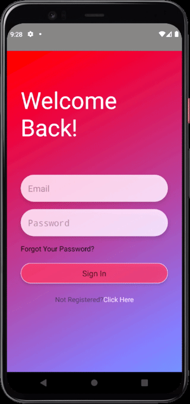
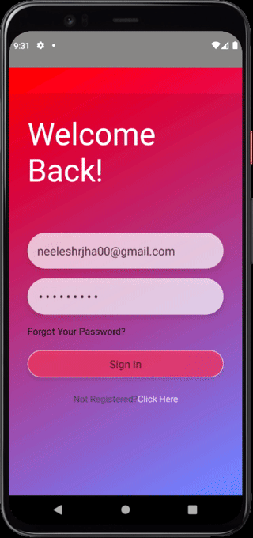
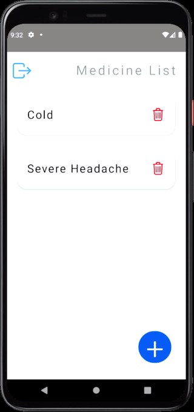

# Medico - Store once, access anywhere
Medico is an android application built using React Native which is actually just a To-Do list with a focus on storing your medicine information on a Cloud DB.
 
I have used React Navigation, Redux, redux thunk and wrote an API which uses JWT for auth/deauth.
 
### Sign Up/ Sign In Screen

 
### Medicine List

 
### Add New
